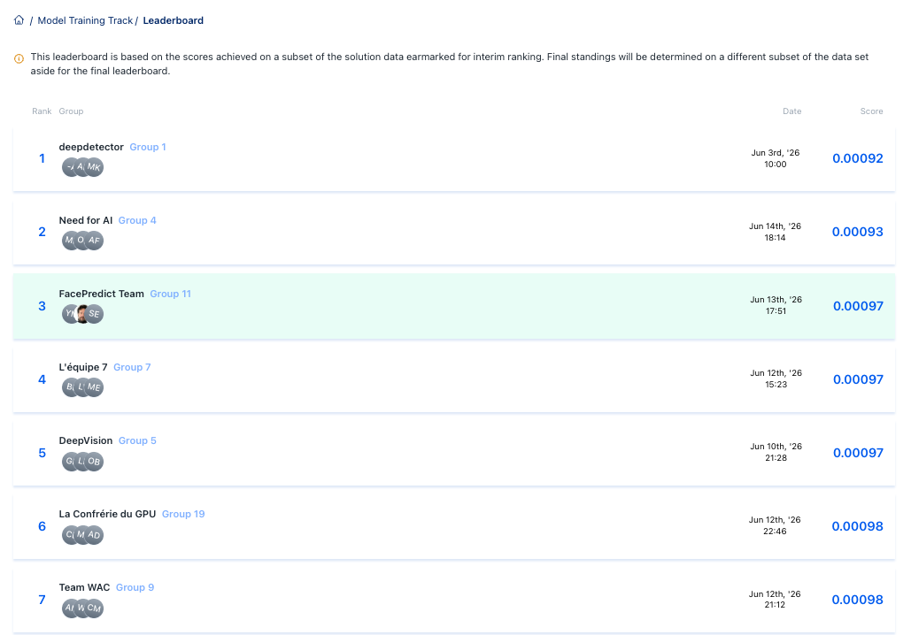
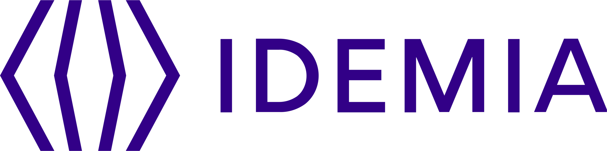

<div align="center">

# 🎭 Face Occlusion Estimation 


<br/>


</div>

---

## Contexte

La reconnaissance faciale repose sur la visibilité des traits du visage. En conditions réelles, ceux-ci
sont fréquemment masqués masque sanitaire, main, lunettes, cheveux, ou tout autre objet. Mesurer
**quelle proportion d'un visage est occultée** est donc une étape clé pour estimer la fiabilité d'un
système biométrique. C'est le problème posé par ce challenge, fourni par **IDEMIA**.

## Problématique


<div align="center">

</br>

| Entrée | Sortie | Contrainte |
|:---:|:---:|:---:|
| Image visage `224×224` | Score d'occlusion `[0, 1]` | Équité Femmes / Hommes |


<br/>


</div>

---

## La métrique d'évaluation

L'erreur est une **MSE pondérée** qui pénalise davantage les fortes occlusions, puis on **moyenne par genre** avec une **pénalité de disparité** :

```math
\mathrm{Err} = \frac{\sum_i w_i\,(p_i - GT_i)^2}{\sum_i w_i}, \qquad w_i = \frac{1}{30} + GT_i
```

```math
\mathrm{Score} = \frac{\mathrm{Err}_F + \mathrm{Err}_M}{2} \;+\; \bigl|\,\mathrm{Err}_F - \mathrm{Err}_M\,\bigr|
```


---

## Installation

```bash
git clone https://github.com/saraelmoun/FaceOcclusion_Training_Track.git
cd FaceOcclusion_Training_Track
pip install -r requirements.txt
export CROPS_DIR=/chemin/vers/les/images   # crops visages 224×224 (.webp)
```

> Renseignez leur chemin via `CROPS_DIR`.


</br> 

--- 

## Reproduire les résultats

#### Depuis les poids entraînés

```bash
bash weights/download_weights.sh                            # poids depuis Hugging Face (public)
python inference.py --weights_dir weights --out predictions
python assemble.py
```

#### Ré-entraînement complet


```bash
for arch in dinov2 convnext faceptor; do
  for fold in 0 1 2 3 4; do
    python src/run_fold.py --arch $arch --fold $fold --device cuda:0
  done
done
python assemble.py
```

> Les deux options génèrent les fichiers finaux dans `submission/`
> (version brute + calibrations `sq` et `cube`).

---

## 🥉 Résultats

<div align="center">



<sub><i>Classement interim — Data Challenge IDEMIA × Télécom Paris.</i></sub>

</div>

---

<div align="center">

`FacePredict Team` — `Group 11`


<table border="0"><tr>
<td align="center" valign="middle" width="280"></td>
<td align="center" valign="middle" width="280"></td>
</tr></table> 

*Data Challenge IDEMIA × Télécom Paris · Institut Polytechnique de Paris*

</div>
